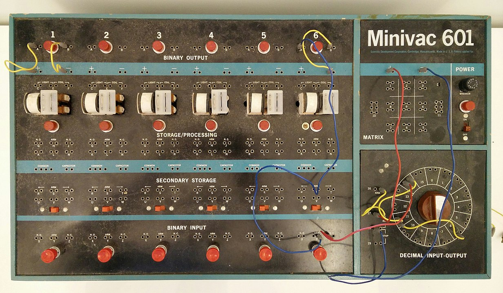

.. created by sphinx-quickstart on Mon Jan  1 20:47:38 2024.

数字系统设计与实践-实验：
==============================================

.. note::
   Figure Above: A digital computer trainer to teach business people about how computers functioned, design by Claude E. Shannon.

.. _a link: https://domain.invalid/

.. toctree::
   :maxdepth: 1
   :caption: 目录:

   install
   lab1
   lab2
   lab3
   lab4
   lab5
   lab6
   lab7
   lab8

说明
==========
.. warning::
   实验真的不难，还有助教可询；鼓励讨论学习，禁止直接抄袭。
.. warning::
   一定要注意学术诚信！提交的代码会被查重工具软件检查的！

- 每一个实验，先跟着每一个实验教程做；然后回答问题，最后提交实验报告
- *实验报告只写问题部分即可 !!*
- 实验报告模板：[下载](link)

