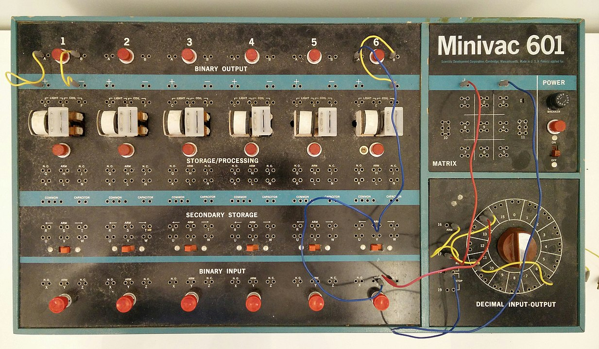

.. created by sphinx-quickstart on Mon Jan  1 20:47:38 2024.

数字系统设计与实践-实验🦾
==============================================

任课教师：燕博南、张诚

Figure Above: A digital computer trainer to teach business people about how computers functioned, design by Claude E. Shannon.

.. _a link: https://domain.invalid/

.. toctree::
   :maxdepth: 1
   :caption: 目录:

   install
   lab1
   lab2
   lab3
   lab4
   lab5
   lab6
   lab7
   lab8

说明
==========
.. warning::
   实验真的不难，还有助教可询；鼓励讨论学习，禁止直接抄袭。
.. warning::
   一定要注意学术诚信！提交的代码会被查重工具软件检查的！

- 每一个实验，先跟着每一个实验教程做；然后回答问题，最后提交实验报告
- *实验报告只写问题部分即可 !!*
- 实验报告模板：template_

.. _template:
   _static/assets/report_template.docx

Verilog 2005标准：standard_

.. _standard:
   _static/assets/IEEE.1364-2005_Verilog2005.pdf

日程安排
==========
.. csv-table:: 日程安排
   :header: "周次", "工作日", "日期", "内容", "知识点"

   "第8周","周一","4/20","实验0：环境配置","数字信号与FPGA"
   "第8周","周四","4/23","实验1(组合逻辑)、实验2(时序逻辑)","HDL"
   "第9周","周一","4/27","期中考试🥳","---"
   "第9周","周四","4/30","实验3(Verilog迷思)、实验4(FSM)","通信接口：UART、SPI、I2C、AMBA总线"
   "第10周","周一","5/4","劳动节放假🥳","---"
   "第10周","周四","5/7","实验5(通信接口)","UART、SPI、I2C"
   "第10周","周六","5/9","实验6(存储器)","成电路中的存储器"
   "第11周","周一","5/11","实验7(逻辑综合)","ASIC与逻辑综合"
   
   "第11周","周四","5/14","实验8(卷积计算加速)","FPGA/ASIC加速器(accelerator)"
   "第12周","周一","5/18","实验8(卷积计算加速)","深度学习加速器"
   "第12周","周四","5/21","实验8讨论","深度学习加速器"
   "第13周","周一","5/25","实验8讨论","系统设计流程（Top-Down方法）、跨时钟域通信技巧、低功耗设计技巧"
   "第13周","周四","5/28","端午节放假🥳","---"
   "第14周","周一","6/1","实验8讨论","低功耗设计技巧、数模转换"
   "第14周","周四","6/4","实验8讨论","灵活赶最终项目进度"
   "第15周","周一","6/8","实验8讨论","灵活赶最终项目进度"
   "第15周","周四","6/11","实验8讨论","灵活赶最终项目进度"
   "第16周","周一","6/15","实验8讨论","竞赛大作业排名、学期总结"
   

