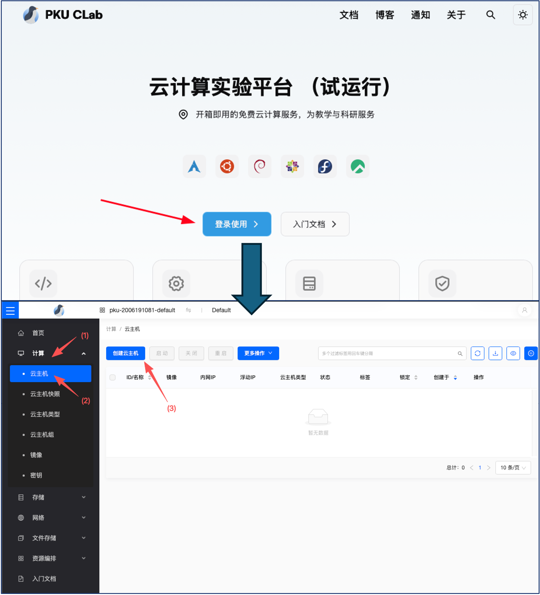
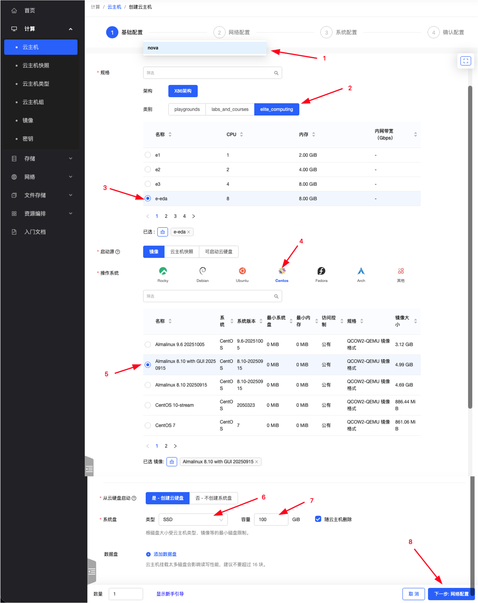
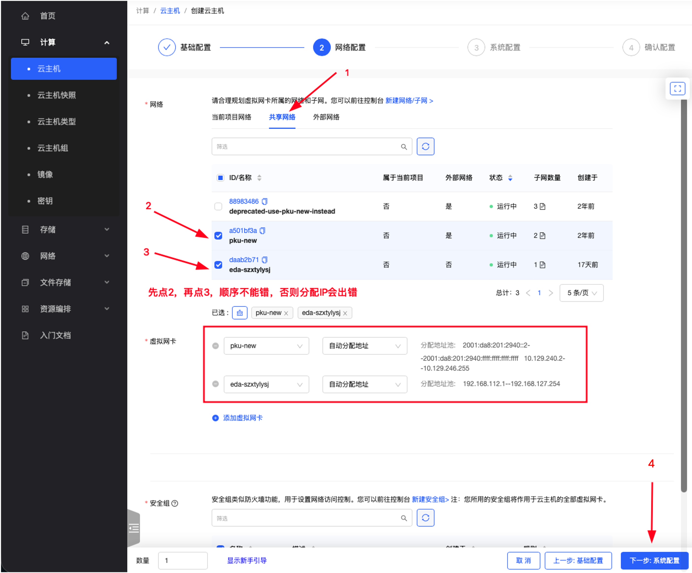
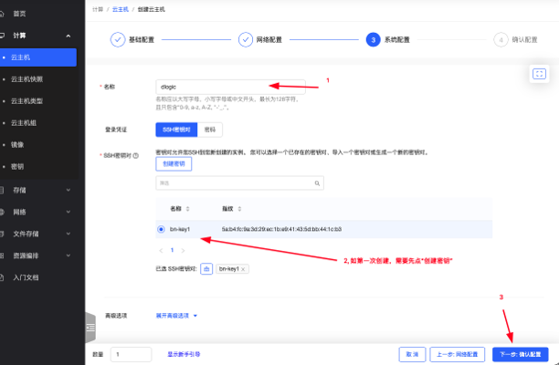

# 实验0、实验准备

Verilog HDL是一款起始于1989年左右的硬件描述语言，至今用于FPGA与ASIC开发；针对FPGA与ASIC开发业已形成了不同的代码编写仿真验证环境工具：

- FPGA: Field-Programmable Gate Array
- ASIC: Application-Specific Integrated Circuits

> **[思考]**
> 都用Verilog HDL,FPGA与ASIC开发流程的区别是什么？

## 1-FPGA开发：Xilinx Vivado

[安装教程](_static/assets/00.vivado2019.1_install.pdf)

[流水灯上板测试](_static/assets/01.vivado下LED流水灯实验及仿真.pdf)

- Alinx提供的Vivado安装
[https://disk.pku.edu.cn/link/AA131552BB0C3B4264B434C888AEA624F8](https://disk.pku.edu.cn/link/AA131552BB0C3B4264B434C888AEA624F8)


## 2-ASIC快速验证：Icarus Verilog+Gtkwave

安装教程：[https://zhuanlan.zhihu.com/p/95081329](https://zhuanlan.zhihu.com/p/95081329)

- 注意安装后如在cmd找不到，请将iverilog/bin文件件添加到环境变量中。

## 3-CLAB 中可以用商用的Synopsys VCS：

学校最近新开发了CLAB实验环境，具体分为：创建第一大步：虚拟主机->第二大步：通过shadowdesktop远程桌面使用vcs+wv进行verilog仿真（后续实验7还会用到dc_shell-t）

### 第一大步：创建CLAB虚拟机

首先你需要在北大校园网内。


#### 本地客户端准备

为了连接到云主机，我们需要一个终端和 SSH 客户端。在 Windows 系统中，我们推荐安装 [Windows Terminal](https://aka.ms/terminal) （Windows11 应已自带）。在 macOS 和 Linux 系统中，我们推荐使用系统自带的终端。

然后，我们需要一个 SSH 密钥对。如果你还没有 SSH 密钥对，可以通过以下方式生成。如果你之前用密钥登录过其他机器，或者电脑的个人目录中已经有`.ssh/id_rsa.pub`或者`.ssh/id_ed25519.pub`文件，可以直接复制现有的.pub 文件到平台，会较为方便。

:::tip 小贴士
我们这里说的用户目录，在 Windows 下指的是 `C:\Users\用户名`，macOS 和 Linux 中指的是`/home/用户名`
:::

下列操作将在 用户目录下`.ssh`文件夹下生成一个名为 `id_ed25519` 的密钥对。`id_ed25519.pub`文件中的内容后续会用到 。请注意，这是密钥的默认位置，你可能已经有一个同名密钥在同一位置了。如果是这样，请直接使用那个密钥，千万不要重新创建！如果重新创建，会有提示，询问是否覆盖。请不要覆盖！

打开终端执行如下命令：

```bash
ssh-keygen -t ed25519
```

如果报错为找不到`ssh-keygen`命令，说明你的 Windows 系统版本较老，推荐更新至近期的 Windows 版本或者下载学生免费版[Xshell](https://www.netsarang.com/en/free-for-home-school/)使用。

#### 一、 登录与准备

1. **访问平台**：在浏览器中打开北京大学 Clab 官方网站（[https://clab.pku.edu.cn/](https://clab.pku.edu.cn/)）。
2. **系统登录**：点击首页的“登录使用”**按钮，选择**“校内统一登陆”完成身份认证并进入系统首页。
3. **进入创建界面**：在首页导航栏中点击“云主机”**，随后点击**“创建云主机”以进入配置向导。

#### 创建课程主机



在左边栏选中`计算-云主机`，进入云主机列表，点击`创建云主机`

##### 第一页：基础配置



请按以下参数依次完成云主机的基础运行环境设置：

- **架构**：选择 `x86` 架构。
- **类别**：选择 `elite_computing`。
- **名称列表**：选择 `e-eda`（配置为 8核 8GB）。
- **启动源**：选择“镜像”。
- **操作系统**：选择 `CentOS`，并在具体版本中选中 `Almalinux 8.10 with GUI 20250915` 镜像。
- **创建云硬盘**：选择“是”，将其作为系统盘。
- **系统盘类型与容量**：类型选择 `SSD`，容量设置为 `100GB`。

##### 第二页：网络配置



选择网络：首先勾选”共享网络“中的`pku-new`，然后勾选”当前项目网络“中的课程 EDA 课程网络，名称一般为`eda-`开头。 先点`pku-new`再点`eda-`的顺序不能颠倒，必须先勾选`pku-new`，再勾选课程网络。

##### 第三页：系统配置



1. 填写名称（可根据个人需求自定义命名），比如`dlogic`
2. 选择密钥。如果之前没有添加过密钥，可以选择“创建密钥”，使用“导入密钥”选项，复制之前生成的`id_ed25519.pub`文件中的内容，粘贴到“公钥”一栏，名称随意。如果之前已经添加过密钥，可以直接选择已有的密钥。

> **附：本地Windows电脑生成与获取 SSH 公钥方法**
> 
> a. 按下 `Win + R` 键，输入 `powershell` 并回车，打开命令行终端（**Windows 系统**）；按下 `Command (⌘) + 空格` 键打开聚焦搜索（Spotlight），输入 `Terminal` 或 `终端` 并回车打开命令行终端。（**macos系统**）
>
> b. **生成公钥**：在终端中输入以下命令并执行。
>
>     
>     ssh-keygen -t ed25519
>     
>     
>     _注：执行后连续按回车键即可；若提示公钥已存在，选择覆盖即可。_
>     
> c. **获取公钥**：在终端中输入以下命令查看公钥内容：
>     
>     
>     cat ~/.ssh/id_ed25519.pub
>    
> d. 将终端输出完整密钥复制，粘贴至网页端的“导入 SSH 公钥”文本框中，并选中该公钥。

##### 第四页：确认配置

- 仔细核对前三页的配置信息，确认无误后提交创建。


- 等待系统分配资源，云主机创建完成后，管理列表中将显示该主机的内网 IP 地址（**以 `10.` 开头**），请记录该地址。

#### 登录主机

1. 通过主机的 IP 地址登录主机，进行后续操作，用户名是`almalinux`。例如：

```Bash
ssh almalinux@10.xx.xx.xx
```

这里`10.xx.xx.xx`应该是你自己的刚创建的虚拟主机IP地址。

如果是MAC、Linux系统可直接在terminal里运行，如果是Windows系统可用系统自带的Powershell或者第三方ssh连接软件[Putty](https://www.chiark.greenend.org.uk/~sgtatham/putty/latest.html)等。

2. **执行 EDA 初始化**：
    
成功登录云主机终端后，执行以下命令配置EDA工具：

```Bash
sudo clabcli eda edadigital2026
```
    
3. **获取桌面凭证**：
    
- 执行:
 ```Bash
 clabcli desktop
 ```
 （**本命令不能加sudo**）后，系统会提示输入您的**学号**。
    
- 输入学号并回车后，终端将输出三项关键信息：**远程桌面网址（URL）**、**生成的账号**以及**密码**。（请务必妥善保存这些信息）。

#### 连接远程桌面

以上步骤仅需完成一次，之后每次从远程桌面登录云主机即可。

访问[https://rdv2.lcpu.dev](https://rdv2.lcpu.dev)，使用刚才系统提供的账号密码登录，即可使用远程桌面。


