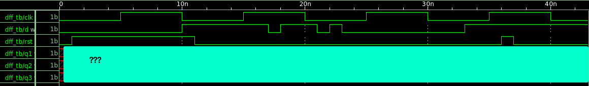

# 实验2、时序逻辑

## 教程

### *1、触发器与锁存器*
时序逻辑部分最重要的知识点就是flip-flop与latch的不同，为了强化这部分的理解，我们直接用实验看一下它们的不同点。请逐行研读一下下面的代码，并且基于“实验1”中的仿真与FPGA部署方法，运行下面的Testbench。

请重点观察：
- 给到D端口的数据什么时候会变？是哪些信号让他们发生了变化？
- Q端的数据怎么样才能保持住（不受D端信号变化的影响）？
- 注意“边缘触发”/“电平触发”/“同步重置”(RESET)/“异步重置”(RESET)的区别

现在有3种时序逻辑器件：a)同步RESET的DFF，b)异步RESET的DFF,和c)D-Latch，你可以预测出来三个Q端输出在下面输入的行为么？



先自己试着预测画一个波形，下面我们来动手实验验证一下你的预测对不对吧！

先写代码，把三种DFF/latch写入同一个文件dff.v里：

#### a) 同步RESET的DFF：
```Verilog
module dff_sync_reset (
data   , // Data Input
clk    , // Clock Input
reset  , // Reset input
q        // Q output
);

input data, clk, reset ; //Input Ports

output reg q;//Output Ports

always @ ( posedge clk)
if (reset) begin
  q <= 1'b0;
end  else begin
  q <= data;
end

endmodule
```

#### b) 异步RESET的DFF：
```Verilog
module dff_async_reset (
data   , // Data Input
clk    , // Clock Input
reset  , // Reset input
q        // Q output
);

input data, clk, reset ; //Input Ports

output reg q;//Output Ports

always @ ( posedge clk or posedge reset)
if (reset) begin
  q <= 1'b0;
end  else begin
  q <= data;
end

endmodule
```

#### c) D(ata)型锁存器 (D-Latch)：
```Verilog
module dlatch_reset (
data   , // Data Input
en     , // LatchInput
reset  , // Reset input
q        // Q output
);

input data, en, reset ; //Input Ports

output reg q; //Output Ports

always @ ( en or reset or data)
if (reset) begin
  q <= 1'b0;
end else if (en) begin
  q <= data;
end

endmodule
```
#### 再写比较三者不同的统一Testbench：
```Verilog
`timescale 1ns/1ns
`include "dff.v"

module dff_tb;

reg d,clk,rst;
wire q1,q2,q3;

initial begin
    $dumpfile("wave.vcd");
    $dumpvars(0);
    $monitor("time=%4t, d=%2b, clk=%2b, rst=%2b, q1=%2b, q2=%2b, q3=%2b",$time,d,clk,rst,q1,q2,q3);
end

initial clk = 0;
always #5 clk = ~clk;

initial begin
    rst = 0;
    #1 rst = 1;
    #10 rst = 0;
    #25 rst = 1;
    #1 rst = 0;
end

initial begin
    d = 0;
    #10 d = 1;
    #7 d = 0;
    #1 d = 1;
    #3 d = 0;
    #1 d = 1;
    #1 d = 0;
    #10 d = 1;
    #10 $finish;
end

dff_sync_reset dut1(
.data   (d)   ,// Data Input
.clk    (clk) ,// Clock Input
.reset  (rst) ,// Reset input
.q      (q1)    // Q output
);


dff_async_reset dut2(
.data   (d)   ,// Data Input
.clk    (clk) ,// Clock Input
.reset  (rst) ,// Reset input
.q      (q2)    // Q output
);

dlatch_reset dut3(
.data (d)   , // Data Input
.en (clk)     , // LatchInput
.reset (rst)  , // Reset input
.q (q3)        // Q output
);

endmodule
```

用iverilog快速验证一下：
```bash
cd [到当前存放dff.v和dff_tb.v的文件夹]
iverilog -o wave dff_tb.v
vvp -n wave
```
如果到此运行顺利的话，当前文件夹会生成一个新的wave.vcd（正如dff_tb.v里面写的$dumpfile("wave.vcd")所写)。然后用gtkwave打开这个波形：
```bash
gtkwave wave.vcd
```
就可以得到[这个](_static/assets/lab2_anw.png)。你之前预测的结果是正确的么？


### *2、普通计数器*

计数器是Verilog里最常见的时序逻辑，其代码（一种实现方式）如下：
```Verilog
module counter    (
out     ,  // Output of the counter
enable  ,  // enable for counter
clk     ,  // clock Input
reset      // reset Input
);

output reg [7:0] out;//Output Ports

input enable, clk, reset;//Input Ports

always @(posedge clk)
if (reset) begin
  out <= 8'b0 ;
end else if (enable) begin
  out <= out + 1;
end

endmodule 
```
思考一下，如out已经达到8'hFF，它会如何变化？先预测一下，下面我们用iverilog或者FPGA验证一下结果。

1）用Iverilog：
#### 先写Testbench:
```Verilog
`timescale 1ns/1ns
`include "counter.v"

module counter_tb;

reg en,clk,rst;
wire [7:0] out;

initial clk = 0;
always #5 clk = ~clk;

initial begin
    $monitor("time=%0t, en=%0b, rst=%0b, out=%0d", $time, en, rst, out);
    $dumpfile("wave.vcd");
    $dumpvars(0);
end

initial begin
    en=1;
    rst = 1;
    #10 rst = 0;
    #5000 $finish;
end

counter dut(
.out(out)     ,  // Output of the counter
.enable(en)  ,  // enable for counter
.clk(clk)     ,  // clock Input
.reset(rst)      // reset Input
);

endmodule
```
然后：
```bash
iverilog -o wave counter_tb.v
vvp -n wave
gtkwave wave.vcd 
```
验证结果。

2）用FPGA来点Fancy的实验吧：

---
## 练习

```{note}
**[问题1]** 请简要回答上面三者：(a) 同步RESET的DFF、(b)异步RESET的DFF、(c)D-Latch在行为上的不同点。
```

### *1、上下计数器*

上下计数器是指计数器可以实现向上数（12345...）与向下数（54321...）的计算数，被计数信号从clk端输入。向下向下数的模式需要设置一个模式控制端口“up_down”:
```
up_down=0: 向上数
up_down=1: 向下数
```
```{note}
**[问题2]** 用Verilog HDL设计上下计数器，并写testbench验证。
```

### *2、格雷码计数器*

格雷码（Gray Code），又称为反射码、单增码、循环码等，是一种二进制编码方式，最早由美国计算机科学家达尔文·格雷（Darwin Gray）在1959年提出。格雷码的特点是在相邻的两个数值之间，只有一个二进制位不同，这种特性使得格雷码在硬件中进行数值切换时，可以最小化错误发生的概率，从而减少开关动作的次数，提高电子设备的可靠性和稳定性。

格雷码基础公式：[https://baike.baidu.com/item/格雷码/6510858](https://baike.baidu.com/item/格雷码/6510858)

| 4位格雷码 | 4位自然二进制码 |
| --------: | --------------: |
|      0000 |            0000 |
|      0001 |            0001 |
|      0011 |            0010 |
|      0010 |            0011 |
|      0110 |            0100 |
|      0111 |            0101 |
|      0101 |            0110 |
|      0100 |            0111 |
|      1100 |            1000 |
|      1101 |            1001 |
|      1111 |            1010 |
|      1110 |            1011 |
|      1010 |            1100 |
|      1011 |            1101 |
|      1001 |            1110 |
|      1000 |            1111 |

```{note}
**[问题3]** 用Verilog HDL设计一个16bit格雷码计数器，并写testbench验证。
```

- 提示：不要用查找表一一对应写！