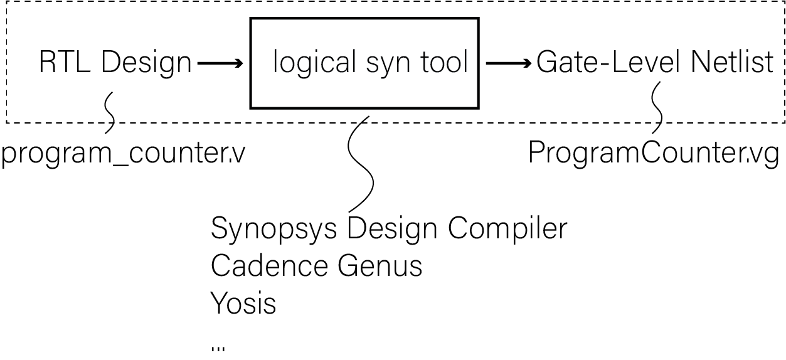
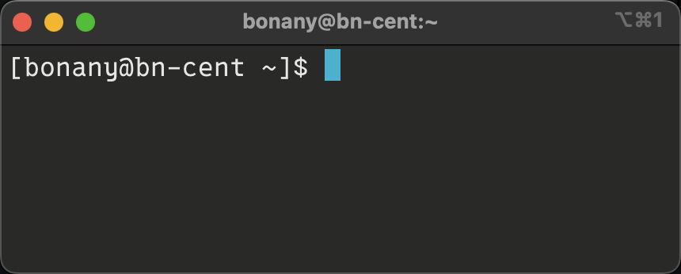
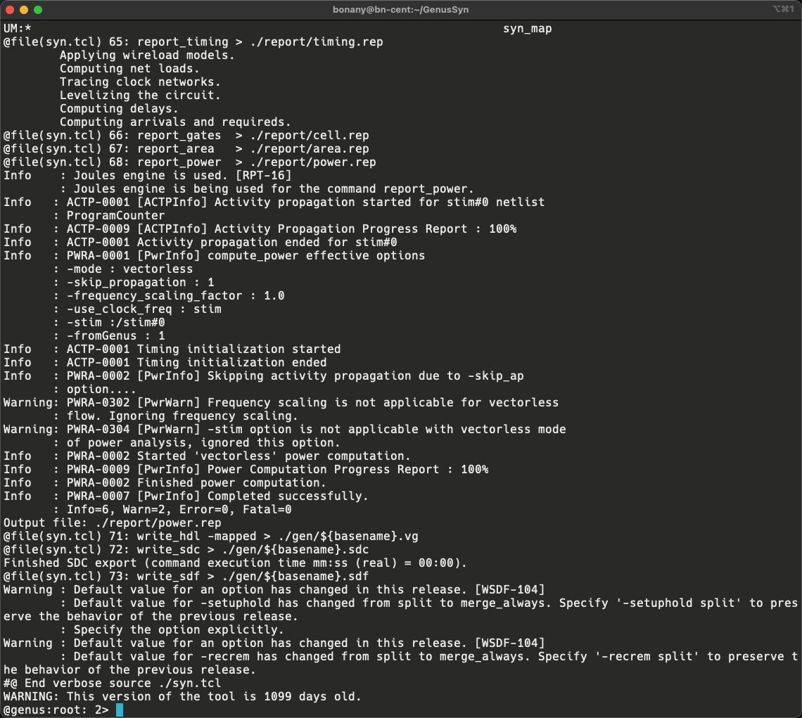

# 实验6、初识逻辑综合

## 教程
逻辑综合（logical synthesis）主要将Register-Transfer-Level (RTL)级的硬件描述语言代码转换为结构化表示。如下面的可综合的Verilog HDL写的可配置记数器在逻辑综合前（RTL）与逻辑综合后（gate-level netlist）的形式分别为【先看一眼logical syn大概是在干啥，后面我们一步一步跟着做一下】：

```{Note}
可配置记数器（programable counter）指的是记数器除了正常向上记数功能外，还可以进入一个额外的“设置”模式，直接把内部DFF的Q端设置成为某数值。
```


- 上图中Pre-syn RTL code【[program_counter.v](_static/assets/program_counter.v)】
- 上图中Post-syn gate-level netlist（由Cadence Genus工具进行逻辑综合的）【[ProgramCounter.vg](_static/assets/ProgramCounter.vg)】

下面我们分三步完成上述逻辑综合工作：

### 第一步：远程连接我们的服务器
#### 方法1：
前提：连接校园网（因为我们的服务器在校园内局域网，如果你在校外需要开北大VPN）
打开powershell或者terminal,直接输入
```bash
ssh [你的账户名]@162.105.19.189
```
然后输入你的密码即可，注意linux命令行中输入密码过程为了保密不显示出来，输完密码按回车就行。

#### 方法2：
如果用windows的话也可以用putty或者Xshell(对学生免费)设置ssh连接，简明教程可以百度到：
- [Xshell连接教程](https://blog.csdn.net/hanjun0612/article/details/118486776)
- [Putty连接教程](https://cloud.tencent.com/developer/article/1332950)

#### 说明：
- 无论用powershell、terminal、Xshell还是putty，你的远程服务器上的账户为：
```bash
username: 你的名字拼音+姓首字母，全小写，比如燕博南：bonany
password: 你的用户名+012（没有加号）
```
- 不管用哪种方法，成功完成远程连接后应该显示类似下图的界面，前面是你自己的账户名，后面“bn-cent”是我们的工作站的主机名：
  
  如果成功了，现在你就可以在我们的服务器上通过网络ssh协议登录并且可以“为所欲为”了

- 首次进去之后如果怕别人进你的账户，可以自行改密码（方法请自己百度/问LLM去）；我们的系统是CentOS 7.9的。
- 我们远程用服务器没有图形界面的，只用命令行。
- 如果想用服务器上需要GUI的工具，比如gvim、gtkwave等，需要在ssh的时候加上-X或者-Y选项，并在自己的本地电脑上安装X11 Server(如[VcXsrv](https://sourceforge.net/projects/vcxsrv/))，具体说明可见[这里](https://zhuanlan.zhihu.com/p/66075449)：
```bash
ssh [你的账户名]@162.105.19.189 -Y
```

### 第二步：把本地的RTL design file上传到服务器自己的账户里面去
#### 方法1：
- 打开powershell或者terminal,直接输入
```bash
cd [你的RTL .v file所在的文件夹]
scp [你的design file.v] [你的账户名]@162.105.19.189:~/
```
然后输个远程账户的密码就传过去了。

说明：
- ```scp```这句的意思就是把你的design file.v上传到IP地址是162.105.19.189的～（用户根目录）里去。

#### 方法2：
- 利用开源免费图形界面工具Windows上的[WinSCP](https://winscp.net/eng/index.php)或MacOS上的小黄鸭[CyberDuck](https://cyberduck.io)，主打一个拖拽操作十分简单
- 具体使用方法请自行百度/问LLM，学习时间约3分钟以内。

### 第三步：在服务器上进行逻辑综合（我们用Genus）
1. 为师我准备了示例文件夹：/home/opt/share/GenusSyn，先把它copy-paste到自己的根目录：
```bash
cp -r /home/opt/share/GenusSyn ~/
cd ~/GenusSyn
```
复制过来之后可以先用```ls```看一下目录：
```
|-- makefile
|-- src
|   `-- program_counter.v
`-- syn.tcl
```

2. 然后直接输入
```bash
make
```
稍等几分钟，因为这个例子代表已经验证过没有问题，所以应该可以跑出来：


现在以“@genus:root>”开头说明是在genus workspace下，输入```exit```退出到bash shell环境下，会发现多了几个文件：


现在的GenusSyn folder包含以下内容:
```
|-- fv
|   `-- ProgramCounter
|-- gen
|   |-- ProgramCounter.sdc
|   |-- ProgramCounter.sdf
|   `-- ProgramCounter.vg
|-- genus.cmd
|-- genus.log
|-- makefile
|-- report
|   |-- area.rep
|   |-- cell.rep
|   |-- power.rep
|   `-- timing.rep
|-- src
|   `-- program_counter.v
`-- syn.tcl
```
其中GenusSyn/gen里面的东西是综合出来的结果，包括上述提到的：

- ProgramCounter.vg: 生成的gate-level netlist
- ProgramCounter.sdf: 生成的gate-level netlist里的timing信息
- Programcounter.sdc: 我们加的constraints

### Pre-和Post-Syn仿真
Pre-Syn仿真就是用testbench.v去include RTL design file（如本例中为program_counter.v）即可。

而Post-Syn仿真也很简单，与pre-syn simulation唯“三”不同的地方就是：

1. ``` `include ProgramCounter.vg ```替代``` `include program_counter.v```
2. ProgramCounter.vg里引用了PDK的标准库的基础门电路单元，比如aoi (aoi是and-or-inverter的简称，表达式为c=~(a & b | c))、and2等等，因此必须再include上pdk标准单元库的门电路行为模型，我们本次用的openpdk-15nm的Verilog行业模型在```/home/opt/pdk/nangate15nm/front_end/verilog/NanGate_15nm_OCL_conditional.v```，所以要在module外面加上：
   ```Verilog
   `include "/home/opt/pdk/nangate15nm/front_end/verilog/NanGate_15nm_OCL_conditional.v"
   ```
3. 在testbench.v里testbench module内部增加一块代码：
```Verilog
initial $sdf_annotate("ProgramCounter.sdf");
```
当然注意要让运行的程序能找到.sdf file，比如可以加上它自己的路径：
```Verilog 
initial $sdf_annotate("/home/bonany/GenusSyn/gen/ProgramCounter.sdf");
```

#### 具体的pre-syn & post-syn的testbench.v对比为：
Pre-syn testbench.v:
```Verilog
`timescale 1ns/1ns
`include "program_counter.v"
module testbench;
reg clk, rst, en, we, wae;
reg [31:0] dataIn;
wire [31:0] dataOut;

initial begin
    $dumpfile("wave.vcd");
    $dumpvars(0);
end

ProgramCounter u1 (
    .clk(clk)
    ,.reset(rst)
    ,.dataIn(dataIn)
    ,.dataOut(dataOut)
    ,.writeEnable(we)
    ,.writeAdd(wae)
    ,.countEnable(en)
);

initial clk=0;
always #1 clk=~clk;

initial begin
    rst = 1;
    en = 1;
    we = 0;
    wae = 0;
    dataIn = 32'd100;

    #2
    rst = 0;

    #(2*5)
    dataIn = 32'd10;
    we = 1;
    #2
    we = 0;

    #(2*5)
    dataIn = 32'd200;
    we = 1;
    wae = 1;
    #2
    we = 0;
    wae = 0;

    #(2*17)
    $finish;
end

endmodule
```

Post-syn testbench.v:
```Verilog
`timescale 1ns/1ns
//-----------newly revised--------------
`include "ProgramCounter.vg"
`include "/home/opt/pdk/nangate15nm/front_end/verilog/NanGate_15nm_OCL_conditional.v"
//-----------newly revised end----------
module testbench;
reg clk, rst, en, we, wae;
reg [31:0] dataIn;
wire [31:0] dataOut;

initial begin
    $dumpfile("wave.vcd");
    $dumpvars(0);
end

//-----------newly revised--------------
initial $sdf_annotate("/home/bonany/GenusSyn/gen/ProgramCounter.sdf");
//-----------newly revised end----------

ProgramCounter u1 (
    .clk(clk)
    ,.reset(rst)
    ,.dataIn(dataIn)
    ,.dataOut(dataOut)
    ,.writeEnable(we)
    ,.writeAdd(wae)
    ,.countEnable(en)
);

initial clk=0;
always #1 clk=~clk;

initial begin
    rst = 1;
    en = 1;
    we = 0;
    wae = 0;
    dataIn = 32'd100;

    #2
    rst = 0;

    #(2*5)
    dataIn = 32'd10;
    we = 1;
    #2
    we = 0;

    #(2*5)
    dataIn = 32'd200;
    we = 1;
    wae = 1;
    #2
    we = 0;
    wae = 0;

    #(2*17)
    $finish;
end

endmodule
```
```{warning}
在跑上面的程序时，一定要注意路径，问一下include的东西simulator是否能找到。
```
```{warning}
因为我们用的是一个开源标准库，所以功能并不完善，$sdf_annotate的东西可能会被忽略，因此本实验仅作验证流程演示，post-syn仿真时可能延迟在波形中无法显示。
```

---
#### 下面给一下为师我跑的带标记的波形图：
- pre-syn simulation results:


- post-syn simulation results:


post-syn仿真验证功能通过:D

---

注意：生成的PPA报告在GenusSyn/report里。

---
## 练习

```{note}
**[问题1]** 请对于实验四中自己设计的交通灯控制器进行逻辑综合，并进行综合后仿真验证（post-synthesis simulation，或者称为post-syn simulation）。请在报告中提交：（1）带标记的波形图（pre-与post-syn仿真的）功能验证（2）通过查看综合报告（synthesis report）参数填写附表1（见下方）。
```
附表1：

| Specs                     | Unit   | Value |
|:-------------------------:|:------:|:-----:|
| Fastest Working Frequency | Hz     |       |
| Power                     | W      |       |
| Cell Number               | 1      |       |
| Area                      | um^2   |       |

注：Fastest Working Frequency = 1 / (设置的working period - slack)
