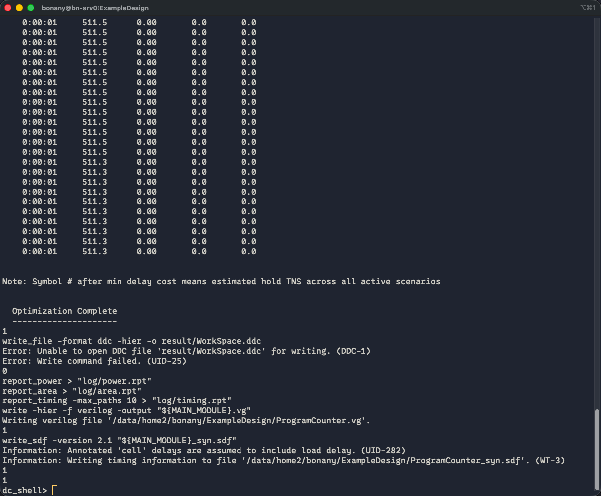
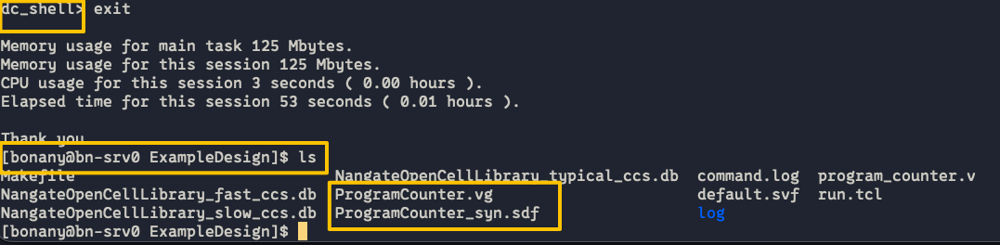
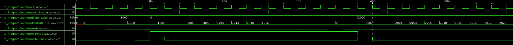
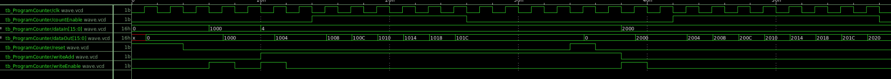

# 实验7、初识逻辑综合

## 教程
逻辑综合（logical synthesis）主要将Register-Transfer-Level (RTL)级的硬件描述语言代码转换为结构化表示。如下面的可综合的Verilog HDL写的可配置记数器在逻辑综合前（RTL）与逻辑综合后（gate-level netlist）的形式分别为【先看一眼logical syn大概是在干啥，后面我们一步一步跟着做一下】：

```{Note}
可配置记数器（programable counter）指的是记数器除了正常向上记数功能外，还可以进入一个额外的“设置”模式，直接把内部DFF的Q端设置成为某数值。
```


- 上图中Pre-syn RTL code `program_counter.v`
- 上图中Post-syn gate-level netlist（由Cadence Genus工具进行逻辑综合的）`ProgramCounter.vg`

下面我们分三步完成上述逻辑综合工作：

### 第一步：远程连接我们的CLAB主机服务器
先完成Lab0中的创建CLAB虚拟主机步骤，然后：

打开[https://rdv2.lcpu.dev](https://rdv2.lcpu.dev),用自己CLAB虚拟主机的账户和密码登录。打开虚拟主机里的Terminal.

### 第二步：复制NFS上的ExampleDesign到自己主机工作目录下

```bash
cd ~
cp -r /mnt/nfs/ExampleDeign-15nm.tar.gz ./
tar -zxvf ExampleDesign-15nm.tar.gz
cd ExampleDesign-15nm
```

可以看到以下几个文件夹：
- rtl: RTL设计文件
- syn: 逻辑综合
- testbench: 测试用例
- pdk: 逻辑综合所使用的标准单元库

### 第三步：在服务器上进行逻辑综合

我们用Synopsys的Design Compiler (简称DC)工具进行逻辑综合

1. 然后执行以下命令以使用dc_shell-t来运行run.tcl脚本，run.tcl内部已经写好了它会使用同文件夹下的.db标准单元库进行逻辑综合，为program_counter.v生成gate-level netlist：

```bash
cd syn
dc_shell-t -f run.tcl
```

注意：这里我其实写了个Makefile，可以直接用`make`来进行综合，用`make clean`来清理工作目录下的所有生成的文件。

2. 稍等几分钟，因为这个例子代表已经验证过没有问题，所以应该可以跑出来：


现在以“dc_shell>”开头说明是在dc workspace下，输入```exit```退出到bash shell环境下，会发现多了几个文件：


- ProgramCounter.vg: 生成的gate-level netlist
- ProgramCounter.sdf: 生成的gate-level netlist里的timing信息
- log/*.rpt: 这个是我们综合出来的报告 (reports)

### Pre-和Post-Syn仿真
Pre-Syn仿真就是用testbench.v去include RTL design file（如本例中为program_counter.v）即可。

而Post-Syn仿真也很简单，与pre-syn simulation唯“三”不同的地方就是：

1. ``` `include ProgramCounter.vg ```替代``` `include program_counter.v```
2. ProgramCounter.vg里引用了PDK的标准库的基础门电路单元，比如aoi (aoi是and-or-inverter的简称，表达式为c=~(a & b | c))、and2等等，因此必须再include上pdk标准单元库的门电路行为模型，我们本次用的openpdk-15nm的Verilog行业模型在```PDK文件夹/front_end/verilog/NanGate_15nm_OCL_conditional.v```，所以要在module外面加上：
   ```Verilog
   `include "/home/opt/pdk/nangate15nm/front_end/verilog/NanGate_15nm_OCL_conditional.v"
   ```
3. 在testbench.v里testbench module内部增加一块代码：
```Verilog
initial $sdf_annotate("具体路径/ProgramCounter_syn.sdf");
```


```{warning}
在跑上面的程序时，一定要注意路径，问一下include的东西simulator是否能找到。
```

我准备了一版运行vcs来跑仿真的代码，分别在
前仿（综合前仿真）：
```bash
cd ~/ExampleDesign-15nm/testbench/pre-syn/
source run_vcs_bash.sh
```

后仿（综合后仿真）：
```bash
cd ~/ExampleDesign-15nm/testbench/post-syn/
source run_vcs_bash.sh
```

建议大家对比`testbench/pre-syn/run_vcs_bash.sh`与`testbench/post-syn/run_vcs_bash.sh`、`testbench/pre-syn/testbench.v`和`testbench/post-syn/testbench.v`的区别。


#### 下面给一下为师我跑的带标记的波形图：

- pre-syn simulation results:


- post-syn simulation results:


post-syn仿真验证功能通过:D

---

注意：生成的PPA报告在syn/log里。

---
## 练习

```{note}
**[问题1]** 请对于实验四中自己设计的交通灯控制器进行逻辑综合，并进行综合后仿真验证（post-synthesis simulation，或者称为post-syn simulation）。请在报告中提交：（1）带标记的波形图（pre-与post-syn仿真的）功能验证（2）通过查看综合报告（synthesis report）参数填写附表1（见下方）。
```
附表1：

| Specs                     | Unit   | Value |
|:-------------------------:|:------:|:-----:|
| Fastest Working Frequency | Hz     |       |
| Power                     | W      |       |
| Cell Number               | 1      |       |
| Area                      | um^2   |       |

注：Fastest Working Frequency = 1 / (设置的working period - slack)
