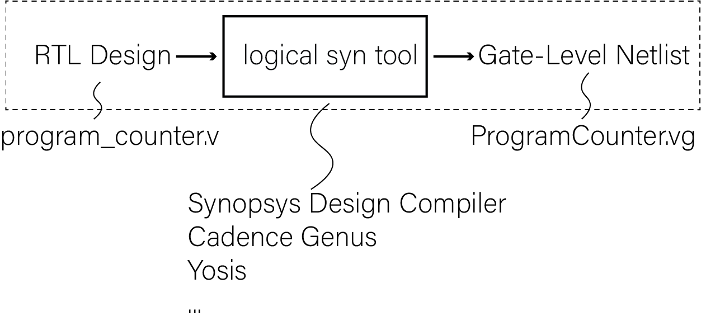
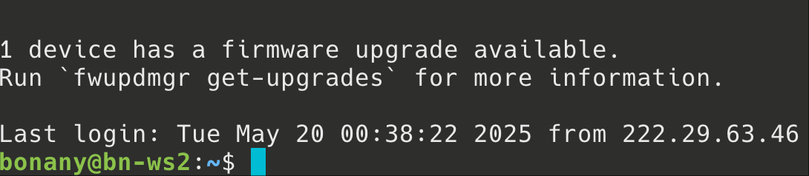
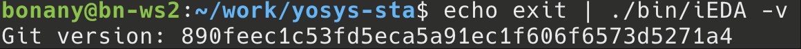
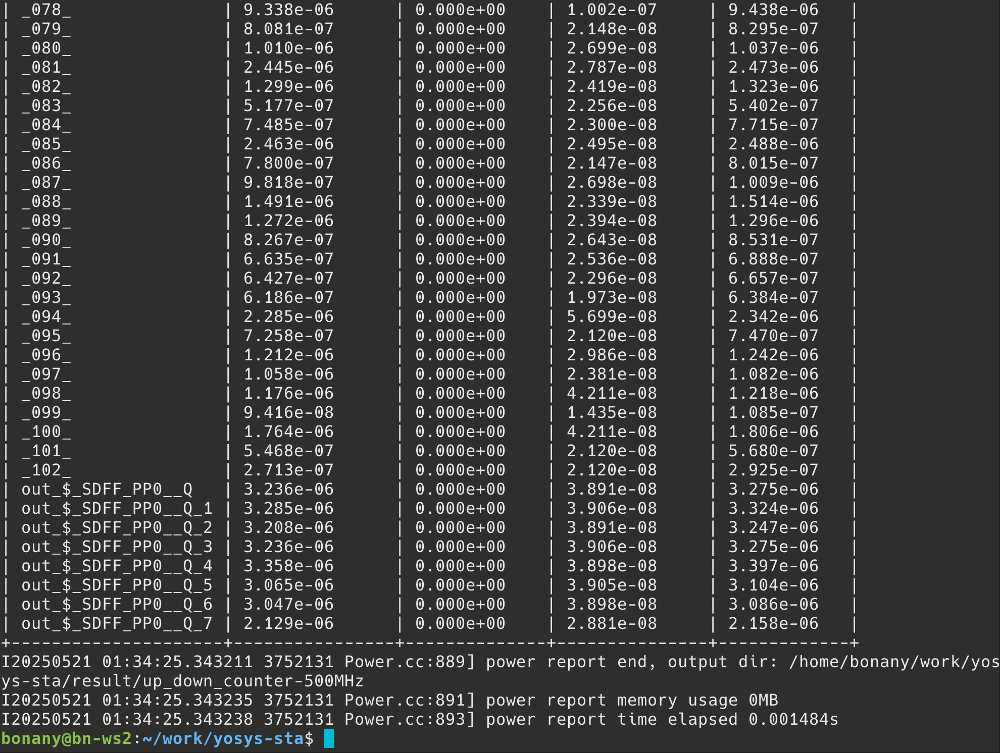
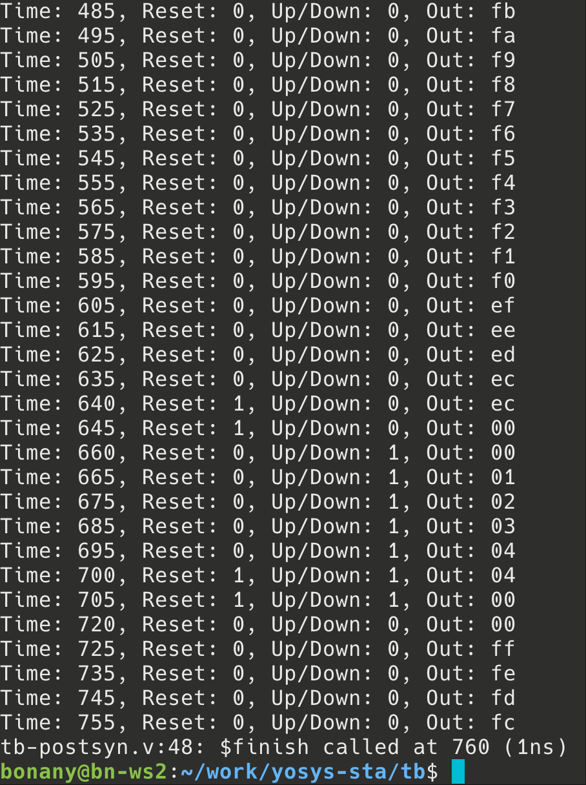

# 实验7、初识逻辑综合

## 【服务器IP】= 162.105.19.154

## 教程
逻辑综合（logical synthesis）主要将Register-Transfer-Level (RTL)级的硬件描述语言代码转换为结构化表示。如下面的可综合的Verilog HDL写的可配置记数器在逻辑综合前（RTL）与逻辑综合后（gate-level netlist）的形式分别为【先看一眼logical syn大概是在干啥，后面我们一步一步跟着做一下】：

```{Note}
可配置记数器（programable counter）指的是记数器除了正常向上记数功能外，还可以进入一个额外的“设置”模式，直接把内部DFF的Q端设置成为某数值。
```


- 上图中Pre-syn RTL code【[program_counter.v](_static/assets/program_counter.v)】
- 上图中Post-syn gate-level netlist（由Cadence Genus工具进行逻辑综合的）【[ProgramCounter.vg](_static/assets/ProgramCounter.vg)】

下面我们分三步完成上述逻辑综合工作：

### 第一步：远程连接我们的服务器
#### 方法1：
前提：连接校园网（因为我们的服务器在校园内局域网，如果你在校外需要开北大VPN）
打开powershell或者terminal,直接输入
```bash
ssh [你的用户名]@【服务器IP】
```

然后输入你的密码即可，注意linux命令行中输入密码过程为了保密不显示出来，输完密码按回车就行。

#### 方法2：
如果用windows的话也可以用putty或者Xshell(对学生免费)设置ssh连接，简明教程可以百度到：
- [Xshell连接教程](https://blog.csdn.net/hanjun0612/article/details/118486776)
- [Putty连接教程](https://cloud.tencent.com/developer/article/1332950)

#### 说明：
- 无论用powershell、terminal、Xshell还是putty，你的远程服务器上的账户为：
```bash
username: s你的学号，如：s2300012345
password: class2025
```
- 不管用哪种方法，成功完成远程连接后应该显示类似下图的界面，前面是你自己的账户名，后面“bn-ws2”是我们的工作站的主机名：
  
  如果成功了，现在你就可以在我们的服务器上通过网络ssh协议登录并且可以“为所欲为”了

- 首次进去之后如果怕别人进你的账户，可以自行改密码（方法请自己百度/问LLM去）；操作系统为Ubuntu。
- 我们远程用服务器没有图形界面的，只用命令行。
- 如果想用服务器上需要GUI的工具，比如gvim、gtkwave等，需要在ssh的时候加上-X或者-Y选项，并在自己的本地电脑上安装X11 Server(如[VcXsrv](https://sourceforge.net/projects/vcxsrv/))，具体说明可见[这里](https://zhuanlan.zhihu.com/p/66075449)：
```bash
ssh [你的账户名]@【服务器IP】 -Y
```

### 第二步：把本地的RTL design file上传到服务器自己的账户里面去
#### 方法1：
- 打开powershell或者terminal,直接输入
```bash
cd [你的RTL .v file所在的文件夹]
scp [你的design file.v] [你的账户名]@【服务器IP】:~/
```
然后输个远程账户的密码就传过去了。

说明：
- ```scp```这句的意思就是把你的design file.v上传到IP地址是【服务器IP】的～（用户根目录）里去。

#### 方法2：
- 利用开源免费图形界面工具Windows上的[WinSCP](https://winscp.net/eng/index.php)或MacOS上的小黄鸭[CyberDuck](https://cyberduck.io)，主打一个拖拽操作十分简单
- 具体使用方法请自行百度/问LLM。

### 第三步：在服务器上进行逻辑综合（我们用开源的Yosis）
1. 准备了示例文件夹：/home/share/，先把它copy到自己的根目录：
```bash
mkdir ~/work
cd ~/work
cp /data/share/yosys-sta.tar.gz .
tar xvzf yosys-sta.tar.gz
cd yosys-sta

#配置一下yosis环境变量,只需要配置一次
echo "export PATH=$PATH:/data/share/oss-cad-suite/bin" >> ~/.bashrc
bash
make init #起始配置iEDA eda工具
echo exit | ./bin/iEDA -v  # 若运行成功, 终端将输出iEDA的版本号，如下图
```




复制过来之后可以先用```ls```看一下目录：
```
yosys-sta
├── bin
│   └── iEDA
├── example
│   └── cnt.v
├── iEDA
├── Makefile
├── pdk
│   └── nangate45
├── README.md
└── scripts
    ├── common.tcl
    ├── default.sdc
    ├── fix-fanout.json
    ├── fix-fanout.tcl
    ├── pdk
    ├── sta.tcl
    ├── yosys-area.tcl
    └── yosys.tcl
```

2. 然后开始进行综合：
```bash
# make clean # if cleanup is needed
make sta
```
稍等几分钟，因为这个例子代表已经验证过没有问题，所以应该可以跑出来：


现在的results/up_down_counter-500MHz包含以下内容:
```bash
result/up_down_counter-500MHz
├── fix-fanout.log
├── sta.log
├── synth_check_fixed.txt
├── synth_check.txt
├── synth_stat_fixed.txt
├── synth_stat.txt
├── up_down_counter.cap
├── up_down_counter.fanout
├── up_down_counter_hold.skew
├── up_down_counter_instance.csv
├── up_down_counter_instance.pwr
├── up_down_counter.netlist.fixed.v
├── up_down_counter.netlist.syn.v
├── up_down_counter.pwr
├── up_down_counter.rpt
├── up_down_counter_setup.skew
├── up_down_counter.trans
├── up_down_counter.v
├── yosys-fixed.log
└── yosys.log
```
这些是逻辑综合出来的结果，包括上述提到的：

运行后, 可在`result/gcd-500MHz/`目录下查看评估结果. 部分文件说明如下:
* `up_down_counter.netlist.syn.v` - Yosys综合的网表文件
* `synth_stat.txt` - Yosys综合的面积报告
* `synth_check.txt` - Yosys综合的检查报告, 用户需仔细阅读并决定是否需要排除相应警告
* `yosys.log` - Yosys综合的完整日志
* `up_down_counter.netlist.fixed.v` - iNO优化扇出后的网表文件
* `fix-fanout.log` - iNO优化扇出的日志
* `synth_stat_fixed.txt` - 优化扇出后Yosys综合的面积报告
* `synth_check_fixed.txt` - 优化扇出后Yosys综合的检查报告
* `yosys-fixed.log` - 优化扇出后Yosys综合的完整日志
* `up_down_counter.rpt` - iSTA的时序分析报告, 包含WNS, TNS和时序路径
* `up_down_counter.cap` - iSTA的电容违例报告
* `up_down_counter.fanout` - iSTA的扇出违例报告
* `up_down_counter.trans` - iSTA的转换时间违例报告
* `up_down_counter_hold.skew` - iSTA的hold模式下时钟偏斜报告
* `up_down_counter_setup.skew` - iSTA的setup模式下时钟偏斜报告
* `up_down_counter.pwr` - iSTA的总体功耗报告
* `up_down_counter_instance.pwr` - iSTA的标准单元级别功耗报告
* `up_down_counter_instance.csv` - iSTA的标准单元级别功耗报告, CSV格式
* `sta.log` - iSTA的日志

### 评估其他设计

有两种操作方式：
1. 命令行传参方式, 在命令行中指定其他设计的信息
   ```shell
   make -C /path/to/this_repo sta \
       DESIGN=mydesign SDC_FILE=/path/to/my.sdc \
       CLK_FREQ_MHZ=100 CLK_PORT_NAME=clk O=/path/to/pwd \
       RTL_FILES="/path/to/mydesign.v /path/to/xxx.v ..."
   ```
1. 修改变量方式, 在`Makefile`中修改上述变量(`DESIGN` `CLK_FREQ_MHZ` `CLK_PORT_NAME`), 然后运行`make sta`

注意:
* 在`RTL_FILES`的文件中必须包含一个名为`DESIGN`值的module
* sdc文件中的时钟端口名称需要与设计文件保持一致, 具体内容可参考样例设计GCD中的相应文件

### Pre-和Post-Syn仿真
Pre-Syn仿真就是用testbench.v去include RTL design file（如本例中为program_counter.v）即可。

而Post-Syn仿真也很简单，与pre-syn simulation唯“三”不同的地方就是：

1. ``` `include "up_down_counter.netlist.syn.v" ```替代``` `include cnt.v```
2. up_down_counter.netlist.syn.v里引用了PDK的标准库的基础门电路单元，比如aoi (aoi是and-or-inverter的简称，表达式为c=~(a & b | c))、and2等等，因此必须再include上pdk标准单元库的门电路行为模型，我们本次用的Verilog模型在```/data/share/nangate45/sim/cells.v```，所以要在module外面加上：
   ```Verilog
   `include "/data/share/nangate45/sim/cells.v"
   ```
3. 在testbench.v里testbench module内部增加一块代码：
```Verilog 
initial $sdf_annotate("path-to-sdf-file/design.sdf");
```
不过本实验的开源工具没有生成相应的sdf时序文件，因此我们先**忽略**这一点。

现在跑一下pre-syn仿真和post-syn仿真：

1. 在yosys-sta下面建一个新的tb文件夹：
```bash
mkdir [path to "yosys-sta"]/tb
```
1. 写两个新的[tb.v](_static/assets/tb.v)与[tb-postsyn.v](_static/assets/tb-postsyn.v)
2. 分别运行：
```bash
#pre-syn tb
iverilog tb.v -o presyn.out
vvp presyn.out

#post-syn tb
iverilog tb-postsyn.v -o postsyn.out
vvp postsyn.out
```
正常跑完应该长这样：


```
```{warning}
在跑上面的程序时，一定要注意*路径*，问一下include的东西simulator是否能找到。
```
```{warning}
因为我们用的是一个开源标准库，所以功能并不完善，$sdf_annotate的东西被忽略，因此本实验仅作验证流程演示，post-syn仿真时可能延迟在波形中无法显示。
```
post-syn仿真验证功能通过:D


---
## 练习

```{note}
**[问题1]** 请对于实验四中自己设计的交通灯控制器进行逻辑综合，并进行综合后仿真验证（post-synthesis simulation，或者称为post-syn simulation）。请在报告中提交：（1）带标记的波形图（pre-与post-syn仿真的）功能验证（2）通过查看综合报告（synthesis report）参数填写附表1（见下方）。
```
附表1：

| Specs                     | Unit   | Value |
|:-------------------------:|:------:|:-----:|
| Fastest Working Frequency | Hz     |       |
| Power                     | W      |       |
| Cell Number               | 1      |       |
| Area                      | um^2   |       |

注：Fastest Working Frequency = 1 / (设置的working period - slack)
