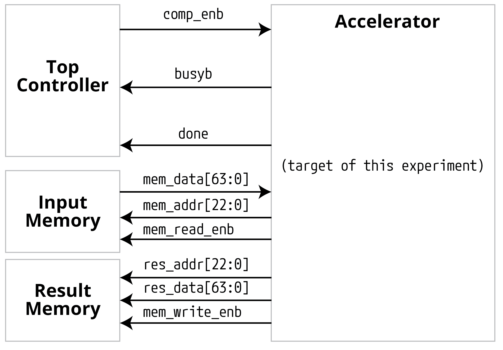

# 实验8、矩阵乘法器及设计优化（课程竞赛大作业）

【实验8没有练习与提交的东西，只是为了熟悉加速器设计流程与环境配置】

目标：加速矩阵乘法

## 硬件加速器的系统接口

以RISC-V CPU提供的协处理器接口为：【图1】


其中：
- cmd: CPU给出的指令
- resp: 加速器返回的指令
- mem.req：加速器要求的数据（以指令或中断形式发出），一般为加速器输入
- mem.resp: CPU cache返回的数据，一般为加速器输出的计算结果

但是!为了避开CPU设计应答的部分（以后《计算机系统架构》或相似课程会学的），本实验我们用一个简单的接口来实现：【图2】



## 为什么硬件加速？

如果用Python软件来计算Lab5中的向量-矩阵乘法（**Y**=**X·W**，结果维度应为1×2）：
```Python
import numpy as np
import time

x = np.matrix(np.random.randint(1, 15, size=(1, 3)), dtype=np.uint8)
w = np.matrix(np.random.randint(1, 15, size=(3, 2)), dtype=np.uint8)

times = np.zeros(1000)
for i in range(1000):
    startTime = time.time()
    y = x * w
    times[i] = time.time()-startTime

print(f"Time taken for matrix multiplication: \n{times.mean()} sec")

```
用我的M1 Pro芯片跑出来的结果为平均耗时```1.809835433959961e-06 sec```，即约为1.8us；
而Lab5的组合逻辑电路，如果用20ns周期频率单周期即可完成，加速比为1.8us/20ns≈90倍。

当然，现代处理器一般会面临“存储墙”问题，即数据传输速度比计算速度要慢，因此还需要像上面图2一样的数据传输接口。

## 具体问题

即然大语言模型这么火，那么我们就来做一个大模型加速器（部分）吧！由于【图3】：


所示，Self-Attention算法模块的参数量占了绝大多数计算操作数，所以我们先仅关注Self-Attention的计算。那么Self-Attention模块的计算表达式为：


如果用流程图来表示，它做的计算为：


## 简化版问题（目标问题）

Y=XW矩阵乘法计算。

### 说明1:
- 一切手段都可以用，但是要满足以下条件
- 设所有输入的操作数均为SINT8，输入矩阵维度均为512×512

### 说明2, 基本加速器框架为:
- 加速器框架: [lab8_framework.tar.gz](_static/assets/lab8_framework.tar.gz)
- 加速器Verilator快速仿真框架: [lab8_flow_fast.tar.gz](_static/assets/lab8_flow_fast.tar.gz) (内有readme.html)
- 示例输入与结果检查见 [lab8_flow_240721.zip](_static/assets/lab8_flow_240721.zip) :
  - 生成伪随机输入input_mem.csv (生成的结构是前512*512/8个地址为第一个矩阵，地址23'd32768开始为第二个512*512*INT8矩阵): ```make generate_input```
  - 检查结果 (需要把CheckResult.py里第40行注掉并解注41行):```make check_result```
  - 加速器在verilog里计算并把结果置于result_mem.csv: ```make```
  - 清空生成代码：```make clean```
- Input Memory与Result Memory的数据排布方式由你决定，不过起始输入排布和最终检查结果会用上面```make generate_input```与```make check_result```进行，所以中间的数据重新排布可以用C++/Python软件程序的方式进行（按需自己写就行）

### 说明3, 关于片上Buffer:
- 全世界只有一个1ns~2ns的时钟。注意，是仅能用一个时钟，但是它的频率可以在1ns~2ns之间任意选择，精确到小数点后2位。
- SRAM memory读延迟<1ns, SRAM可选择的参数 (IO bit width, 可以存多少个word，以及对应的面积和功耗)在[SRAM_available_specs](_static/assets/SRAM_Specs.xlsx)里，如果想用更多地址、多大空间，请用提供的这些小模块自行组合
- 功耗计算为：动态功耗(W/Hz)*工作频率(Hz)+静态功耗(W)

### 说明4, 芯片规模与精度：
- 虽然理论上可以做任意规模(如10000)的MAC乘加，但是注意TPUv4中每个unit也就16×16×16=4096个乘法器，华为昇腾单个计算核也不过16×8的维度，千万不要上来就做太多乘加器。
- 我们的输入有35%的稀疏度（35%的零），请考虑一下中间计算结果需要用BF16还是直接用long INT。

### 说明5, 最终加速器评分：
- 计算功能正确占此部分的70%
- 在计算功能正确的情况下，综合得分Score计算公式为：
  - Score = exp(SSE/C0)×功率power(unit:mW)×面积area(unit:um^2)×(时间(us)^2)
  - 其中平方和误差Square-Sum Error (SSE) = ∑((计算结果每个element-正确无损计算结果每个element)^2)，其中C0=1E-3 (这个值是为了让BF16产生的1E-5的SSE影响整体分数在增加1%~5%左右，无损计算SSE=0时第一项应该为1)
  - latency计算方法为从comp_enb的下降沿开始计算，到busyb的上升沿的绝对时间(单位：ns);也可以是cycle number×shortest clock period (target freq-slack)
  - 逻辑综合后critical path setup time slack>0, 对应设置的主频
  - 用到的DFF的PPA都在syn report里，用到的SRAM macro需要单独算
  - 综合的时候请剔除SRAM macro(将SRAM port拉到顶层, 待logic syn的design不应包含SRAM instances)，不然会很大
  - input memory, result memory与top controller不计入PPA计算
  - Top Controller, Input Memory与Data Memory不计入最终PPA评分，我们只看accelerator
- 最后课程成绩相关的（竞赛大作业部分）评分规则：
  - 竞赛大作业部分总分23分
  - 如功能未实现大作业部分为0分
  - 在实现功能后，此部分最低16.10分、最高23.00分，个人最终得分与排名或PPA综合得分绝对值有关
- 截止日期2024年7月25日晚11:58:59，请打包提交至北大教学网Lab8：
  - 设计报告(自己计算一下上面的得分)
  - 设计与测试代码
  - 综合用脚本syn.tcl
  - PPA原始报告 (top level)

```{note}
**提示** 千万不要一下子写一大坨top RTL，一定要分层(hierarchical)一点一点写然后instantiate各个小block再拼起来
```


## 本课程后面每节课，会简介优化方法

时序收敛方法、脉动阵列架构、bit-serial乘法、稀疏计算优化……

## 早点动手，多次尝试，把控时间，仔细推敲!